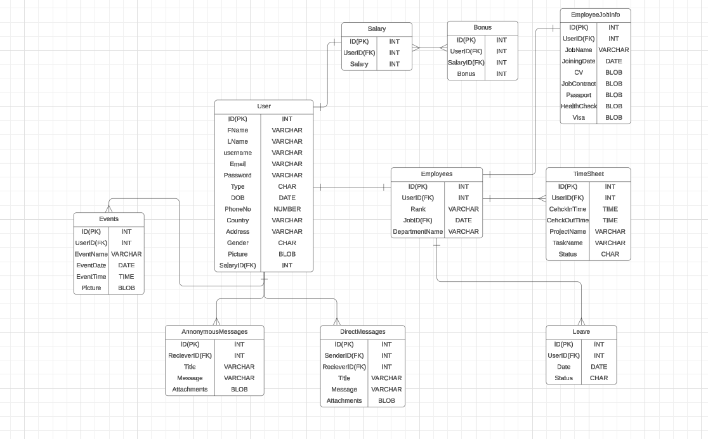

# TalentSphere_Frontend


## Date : 03/2024

## Overview

[Talent Sphere] consists of two main repositories:

- [Frontend](fronend link after changing the name of the project)
- [Backend](backend link after changing the name of the project)

## Live Version

Click the following link to be redirected to the live version of the code. [name of project](link of project)

## About the Project

TalentSphere is a comprehensive HR Management System web application designed to streamline HR processes at a software company. The system provides a user-friendly interface for both HR Admins and Employees to manage various HR-related tasks.

[Trello Board](https://trello.com/b/ZpscjDPo/project4)

## Functionality

### HR Admin:

- Full CRUD access to the database
- Manage employee accounts, vacations, and requests
- Oversee company events and activities

### Employee:

- View personal information and performance
- Request updates and days off
- Access company directory and events

## CRUD Operations

- **Create:** Add new employees, events, and requests
- **Read:** View employee profiles, remuneration details, and event schedules
- **Update:** Modify employee information, approve requests, and update event details
- **Delete:** Remove employee accounts and events from the system

### Screenshots:

ERD:


wireframe:

Real website:

### Technologies used

- [x] VSCode (Editor for Writing the Code)
- [x] Node Js (Backend)
- [x] Express (API Calls)
- [x] postgresql (Databse)
- [x] Angular TS (Frontend)
- [x] Trelllo (Managment for the work)
- [x] lucidchart (ERD for the database)

---

### What we are most proud of is :

## function

```
 code
```

---

### Future plans:

- [ ]

---

Our team:

- Fatima Fouad ([github repo](https://github.com/fsky99))
- Shaika Ebrahim ([github repo](https://github.com/Shaikhask))
- Shaika Abdulla ([github repo](https://github.com/Shaikha277))
- Ahmed RAli ([github repo](https://github.com/Ahmedrali1))
